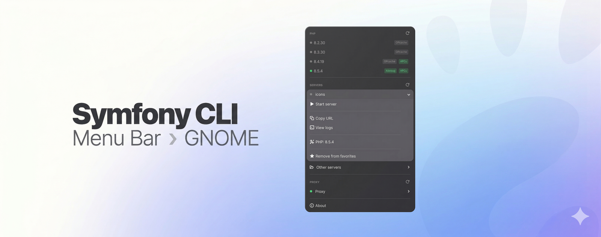

# Menu Bar for Symfony

> A native Gnome menu bar app for managing local [Symfony CLI](https://github.com/symfony-cli/symfony-cli) servers.



Access, start, and stop your local Symfony servers from the menu bar. Open them in your browser, view logs, manage PHP versions and proxy domains — without leaving your current context.

## Features

- **Server management**: view all your Symfony local servers at a glance; start and stop them directly from the menu
- **One-click browser open**: open any running server in your default browser instantly
- **Server logs**: jump straight to `symfony server:log` in Terminal, pre-filled for the right project
- **PHP versions**: see all installed PHP versions and set the default
- **Set PHP version** set specific PHP version for a project
- **Start at Login**: launch on login so it is always available

## Requirements

- gnome 49.0 or later
- [Symfony CLI](https://symfony.com/download) installed and available in your `PATH`

## Installation
### Download (recommended)

TODO: this package will be available by default distro package managers soon.

### Build from Source

```bash
git clone https://github.com/tito10047/menubar-for-symfony
cd symfony-cli-menubar

# Build and package
# this process will logout you from your current session
npm install
./install-local.sh

```


## Custom Actions

You can add custom shell commands to every server's context menu by creating an `actions.json` file in the extension directory:

```json
[
  {
    "name": "Deploy",
    "command": "npm run deploy",
    "icon": "mail-send-symbolic",
    "inline": true
  },
  {
    "name": "Open in VS Code",
    "path": "~/work/project",
    "command": "code .",
    "icon": "document-open-symbolic"
  }
]
```

| Field | Required | Description |
|---|---|---|
| `name` | yes | Label shown in menu |
| `command` | yes | Shell command to run |
| `path` | no | Working directory; defaults to the server's project directory |
| `icon` | no | Symbolic icon name; defaults to `system-run-symbolic` |
| `inline` | no | `true` = also show as an icon button in the compact server row |

The command runs as: `bash -c "cd '<path>' && <command>"`.

### Magic variable `{path}`

Use `{path}` in both `path` and `command` fields — it is replaced at runtime with the server's project directory:

```json
[
  {
    "name": "Open in VS Code",
    "path": "{path}",
    "command": "code {path}",
    "icon": "document-open-symbolic"
  },
  {
    "name": "Git pull",
    "command": "git -C {path} pull",
    "icon": "view-refresh-symbolic",
    "inline": true
  }
]
```

File location:

```
~/.local/share/gnome-shell/extensions/menubar-for-symfony@tito10047.github.com/actions.json
```

Actions defined without `"inline": true` appear only in the submenu of favorite servers. Actions with `"inline": true` also appear as icon buttons in the compact (non-favorite) server rows.

## Debug Logging

Verbose logging (debug/info messages) is **disabled by default** to keep the system journal clean.

Enable it when troubleshooting via GSettings:

```bash
gsettings set org.gnome.shell.extensions.symfony-menubar debug-logging true
```

Disable it again with:

```bash
gsettings set org.gnome.shell.extensions.symfony-menubar debug-logging false
```

The change takes effect immediately without restarting the extension. Errors and warnings are always logged regardless of this setting.
To read extension logs use:

```bash
journalctl -f -o cat /usr/bin/gnome-shell
```

## MacOS X version

see [smnandre/symfony-cli-menubar](https://github.com/smnandre/symfony-cli-menubar)

## Contributing

Contributions are welcome. Please open an issue before submitting a pull request for significant changes.
See [CONTRIBUTING.md](.github/CONTRIBUTING.md) for development guidelines.

## Thanks

Menu Bar for Symfony builds on top of remarkable open source work.

**[Symfony](https://symfony.com)**: the PHP framework this whole ecosystem is built on.
Fabien Potencier [@fabpot](https://github.com/fabpot) and the Symfony contributors.

**[Symfony CLI](https://github.com/symfony-cli/symfony-cli)**: the local server tooling this app brings to your menu
bar.
Fabien Potencier [@fabpot](https://github.com/fabpot) and Tugdual Saunier [@tucksaun](https://github.com/tucksaun).

## License

Released by [Jozef  Môstka](https://vsetkosada.sk/en) under the [MIT License](LICENSE).

This project is inspired by [Symfony CLI Menu bar](https://github.com/smnandre/symfony-cli-menubar) by [@smnandre](https://github.com/smnandre).

"Symfony" and the Symfony logo are registered trademarks of [Symfony SAS](https://symfony.com).  

