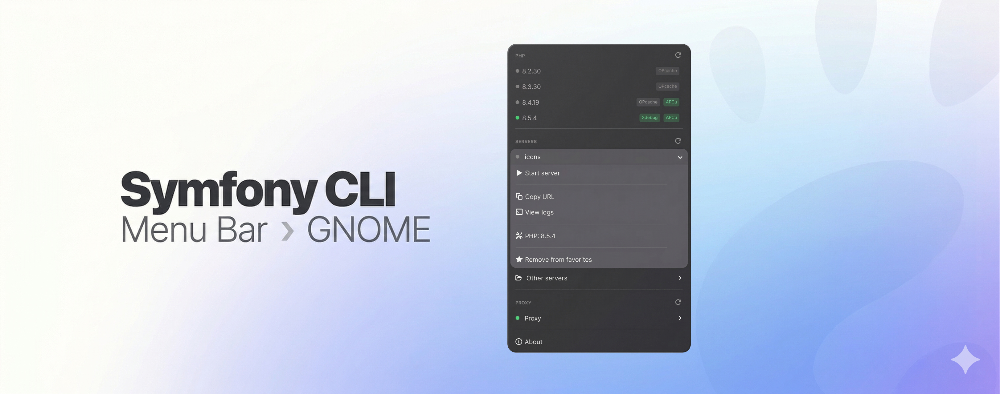

# Menu Bar for Symfony

> A native Gnome menu bar app for managing local [Symfony CLI](https://github.com/symfony-cli/symfony-cli) servers.



Access, start, and stop your local Symfony servers from the menu bar. Open them in your browser, view logs, manage PHP versions and proxy domains — without leaving your current context.

## Features

- **Server management**: view all your Symfony local servers at a glance; start and stop them directly from the menu
- **One-click browser open**: open any running server in your default browser instantly
- **Server logs**: jump straight to `symfony server:log` in Terminal, pre-filled for the right project
- **PHP versions**: see all installed PHP versions and set the default
- **Set PHP version** set specific PHP version for a project
- **Start at Login**: launch on login so it is always available

## Requirements

- GNOME 49.0 or later
- [Symfony CLI](https://symfony.com/download) installed and available in your `PATH`
- The **helper app** (see below) — it ships separately from the extension

## Architecture in one paragraph

The extension itself never starts a process. All Symfony CLI calls happen in a
small helper app, `symfony-menubar-daemon`, which the extension talks to over
D-Bus. This split was requested by the GNOME extension reviewers: it keeps the
command logic out of the gnome-shell process and out of the package published on
extensions.gnome.org.

The helper is plain JavaScript executed by `/usr/bin/gjs`, which is part of GNOME
Shell itself — there is nothing extra to install for it to run, and nothing is
compiled. It is started on demand by D-Bus activation and exits again once it has
been idle, so it is not a background service you need to manage.

Its source lives at
[tito10047/symfony-menubar-daemon](https://github.com/tito10047/symfony-menubar-daemon).
The D-Bus contract is mirrored in `src/shared/` of both repositories and guarded
at runtime by `API_VERSION`, so a mismatched pair tells you to update the helper
instead of failing obscurely.

## Installation

### 1. The helper app

The helper lives in its own repository:
**[tito10047/symfony-menubar-daemon](https://github.com/tito10047/symfony-menubar-daemon)**.

Download the latest release tarball from
[its releases page](https://github.com/tito10047/symfony-menubar-daemon/releases),
unpack it and run the installer. It writes only to your home directory and needs
no root privileges:

```bash
tar -xzf symfony-menubar-daemon-1.3.0.tar.gz
cd symfony-menubar-daemon-1.3.0
./install.sh
```

That installs three things:

| Path | Purpose |
|---|---|
| `~/.local/share/symfony-menubar-daemon/symfony-menubar-daemon.js` | the helper itself |
| `~/.local/bin/symfony-menubar-daemon` | launcher, for running it by hand |
| `~/.local/share/dbus-1/services/com.github.tito10047.SymfonyMenubar.service` | lets D-Bus start it on demand |

Remove it again with `./uninstall.sh`.

### 2. The extension

Install *Menubar for Symfony* from [extensions.gnome.org](https://extensions.gnome.org),
or build everything from source:

```bash
git clone https://github.com/tito10047/menubar-for-symfony
cd menubar-for-symfony
npm install

# Builds both halves, installs them, and logs you out so GNOME Shell reloads
./install-local.sh
```

If the menu says the helper app was not found, install it as described above and
then click that message — the extension looks again without needing a restart.

### Settings

```bash
SCHEMA=org.gnome.shell.extensions.symfony-menubar

# How often the helper checks server and proxy state
gsettings set $SCHEMA polling-interval 5

# Terminal used for server logs; %s is replaced by the command to run.
# Empty means: auto-detect ptyxis, gnome-terminal, kgx, konsole or xterm.
gsettings set $SCHEMA terminal-command 'ptyxis -- %s'

# Only needed if the Symfony CLI is not in a standard location
gsettings set $SCHEMA symfony-path /opt/symfony/bin/symfony
```

`symfony-path` exists because the helper is started by D-Bus and therefore does
not inherit your shell's `PATH`. It auto-detects `~/.symfony5/bin`,
`~/.symfony/bin`, `~/.local/bin`, `/usr/local/bin` and `/usr/bin` first, so you
normally never need to set it.


## Custom Actions

You can add custom commands to every server's context menu by creating
`~/.config/symfony-menubar/actions.json`:

```json
[
  {
    "name": "Deploy",
    "command": "npm run deploy",
    "icon": "mail-send-symbolic",
    "inline": true
  },
  {
    "name": "Open in VS Code",
    "path": "~/work/project",
    "command": "code .",
    "icon": "document-open-symbolic"
  }
]
```

| Field | Required | Description |
|---|---|---|
| `name` | yes | Label shown in the menu. Also identifies the action, so it must be unique. |
| `command` | yes | Command to run |
| `path` | no | Working directory; defaults to the server's project directory |
| `icon` | no | Symbolic icon name; defaults to `system-run-symbolic` |
| `inline` | no | `true` = also show as an icon button in the compact server row |

The command is split into arguments the way a shell would split them, and then
executed directly in the working directory. **No shell is involved**, which is
what makes a project path containing spaces or `;` harmless.

If you do need shell features such as pipes or `&&`, ask for a shell explicitly:

```json
{ "name": "Deploy", "command": "sh -c 'npm run build && npm run deploy'" }
```

The helper logs every action it runs, and every action it skips together with the
reason, so a misspelled entry is easy to find:

```bash
journalctl -f -o cat --identifier gjs
```

### Magic variable `{path}`

Use `{path}` in both `path` and `command` fields — it is replaced at runtime with the server's project directory:

```json
[
  {
    "name": "Open in VS Code",
    "path": "{path}",
    "command": "code {path}",
    "icon": "document-open-symbolic"
  },
  {
    "name": "Git pull",
    "command": "git -C {path} pull",
    "icon": "view-refresh-symbolic",
    "inline": true
  }
]
```

File location:

```
~/.config/symfony-menubar/actions.json
```

Before version 1.3 this file lived inside the extension directory, where GNOME
deleted it on every extension update. `daemon/install.sh` moves an existing file
to the new location for you.

Actions defined without `"inline": true` appear only in the submenu of favorite servers. Actions with `"inline": true` also appear as icon buttons in the compact (non-favorite) server rows.

## Debug Logging

Verbose logging (debug/info messages) is **disabled by default** to keep the system journal clean.

Enable it when troubleshooting via GSettings:

```bash
gsettings set org.gnome.shell.extensions.symfony-menubar debug-logging true
```

Disable it again with:

```bash
gsettings set org.gnome.shell.extensions.symfony-menubar debug-logging false
```

The change takes effect immediately without restarting the extension, and it
applies to the helper app as well. Errors and warnings are always logged
regardless of this setting.

The two halves log to two different places:

```bash
# the extension
journalctl -f -o cat /usr/bin/gnome-shell

# the helper app
journalctl -f -o cat --identifier gjs
```

## MacOS X version

see [smnandre/symfony-cli-menubar](https://github.com/smnandre/symfony-cli-menubar)

## Contributing

Contributions are welcome. Please open an issue before submitting a pull request for significant changes.
See [CONTRIBUTING.md](.github/CONTRIBUTING.md) for development guidelines.

## Thanks

Menu Bar for Symfony builds on top of remarkable open source work.

**[Symfony](https://symfony.com)**: the PHP framework this whole ecosystem is built on.
Fabien Potencier [@fabpot](https://github.com/fabpot) and the Symfony contributors.

**[Symfony CLI](https://github.com/symfony-cli/symfony-cli)**: the local server tooling this app brings to your menu
bar.
Fabien Potencier [@fabpot](https://github.com/fabpot) and Tugdual Saunier [@tucksaun](https://github.com/tucksaun).

## License

Released by [Jozef  Môstka](https://vsetkosada.sk/en) under the [GNU General Public License v2.0 or later](LICENSE) (GPL-2.0-or-later).

This project is inspired by [Symfony CLI Menu bar](https://github.com/smnandre/symfony-cli-menubar) by [@smnandre](https://github.com/smnandre).

"Symfony" and the Symfony logo are registered trademarks of [Symfony SAS](https://symfony.com).  

