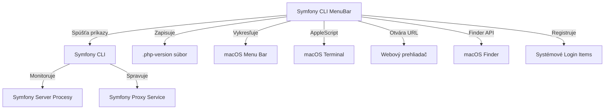

# Hrubá analýza projektu: Symfony CLI Menu Bar

Tento dokument obsahuje výsledky analýzy pôvodného projektu `smnandre/symfony-cli-menubar` so zameraním na funkcionalitu a systémové integrácie.

## 1. Zoznam funkcionalít (Čo to robí)

Aplikácia slúži ako grafické rozhranie v systémovej lište (menu bar) pre správu lokálneho vývojového prostredia Symfony. Hlavné funkcie zahŕňajú:

- **Informácie o Symfony CLI:** Zisťuje a prehľadne zobrazuje verziu nainštalovaného nástroja Symfony CLI.
- **Správa PHP verzií:**
    - Zobrazuje zoznam všetkých PHP verzií dostupných v systéme, ktoré Symfony CLI rozpoznáva.
    - Umožňuje jedným kliknutím nastaviť konkrétnu verziu PHP ako predvolenú pre systém (zápisom do `.php-version`).
    - Poskytuje rýchly prístup k ceste binárneho súboru PHP (kopírovanie, zobrazenie vo Finderi).
- **Správa lokálnych Symfony serverov:**
    - Monitoruje stav (beží/stojí) všetkých lokálnych Symfony projektov.
    - Zobrazuje dôležité detaily o bežiacich serveroch: port, URL (HTTP/HTTPS), verziu PHP pod ktorou bežia, stav SSL certifikátu a PID procesu.
    - Umožňuje spúšťať a zastavovať servery pre jednotlivé projekty priamo z menu.
    - Obsahuje funkciu "Stop All Servers" na hromadné ukončenie všetkých bežiacich inštancií.
- **Integrácia s projektovými nástrojmi:**
    - Otváranie webovej adresy projektu v predvolenom prehliadači.
    - Otvorenie koreňového adresára projektu vo Finderi.
    - Otvorenie novej inštancie terminálu priamo v adresári projektu.
    - Živé sledovanie logov servera (`server:log`) v novom okne terminálu.
- **Správa lokálneho Symfony Proxy:**
    - Indikuje, či je lokálna proxy služba (pre `.wip` domény) aktívna.
    - Umožňuje spustiť alebo zastaviť proxy službu.
    - Zobrazuje zoznam všetkých nakonfigurovaných proxy domén.
    - Umožňuje odpojiť (detach) doménu od proxy služby.
- **Prispôsobenie a systémové nastavenia:**
    - Možnosť nastaviť automatické spúšťanie aplikácie po štarte systému (Start at Login).
    - Nastavenie periodicity automatického obnovovania stavu serverov.
    - Možnosť skryť alebo zobraziť jednotlivé sekcie menu (PHP, Proxy, Servery).
- **Správa aktualizácií:** Integrovaná podpora pre automatické aktualizácie aplikácie (cez Sparkle framework).

## 2. Systémové integrácie (Kde sa to dotýka OS)

Aplikácia je hlboko integrovaná s macOS a využíva systémové nástroje na vykonávanie svojich úloh.

### Externé príkazy (Shell commands)
Aplikácia funguje ako nadstavba nad Symfony CLI. Spúšťa nasledujúce príkazy:
- `symfony version --no-ansi`: Zistenie verzie CLI.
- `symfony server:list --no-ansi`: Získanie zoznamu lokálnych serverov a ich stavu.
- `symfony local:php:list --no-ansi`: Zoznam dostupných PHP verzií.
- `symfony proxy:status --no-ansi`: Kontrola stavu proxy.
- `symfony server:start -d --dir <path>`: Spustenie servera na pozadí pre konkrétny priečinok.
- `symfony server:stop --dir <path>`: Zastavenie servera pre konkrétny priečinok.
- `symfony proxy:start` / `symfony proxy:stop`: Ovládanie proxy služby.
- `symfony proxy:domain:detach <domain>`: Odpojenie domény od proxy.
- `/usr/bin/which symfony`: Vyhľadanie cesty k Symfony CLI binárke, ak nie je v štandardných umiestneniach.

### Práca so súbormi a cestami
- **Lokalizácia binárky:** Aplikácia prehľadáva cesty: `/usr/local/bin/symfony`, `/opt/homebrew/bin/symfony` a `~/.symfony5/bin/symfony`.
- **Zápis konfigurácie:** Pri zmene predvolenej verzie PHP zapisuje priamo do súboru `~/.php-version` v domovskom adresári používateľa.
- **Prístup k projektom:** Číta cesty k projektom z výstupu Symfony CLI a používa ich na navigáciu (Finder/Terminal).

### Sledovanie procesov
- Aplikácia neimplementuje vlastné sledovanie procesov na úrovni jadra. Namiesto toho spracováva **PID (Process ID)**, ktoré jej poskytuje Symfony CLI vo výstupe príkazu `server:list`. Tieto ID následne zobrazuje v rozhraní.

### Komunikácia so systémovou lištou (System Tray)
- Používa natívne macOS API: `NSStatusBar` a `NSStatusItem` na vytvorenie ikony v lište.
- Menu je postavené na `NSMenu` a `NSMenuItem`.
- Využíva `NSHostingView` na vkladanie SwiftUI pohľadov do okien nastavení a informácií o aplikácii.

### Ostatné integrácie
- **AppleScript:** Používa sa na automatizáciu aplikácie **Terminal**. Cez skripty otvára okná a spúšťa v nich príkazy na sledovanie logov.
- **NSWorkspace:** Slúži na otváranie URL adries v prehliadači a na prácu s Finderom (`selectFile`).
- **ServiceManagement (SMAppService):** Moderné macOS API použité na registráciu aplikácie pre automatické spúšťanie po prihlásení.
- **NSPasteboard:** Používa sa na interakciu so systémovou schránkou (kopírovanie URL a ciest).

## 3. Prehľad architektúry integrácií

Nasledujúci diagram znázorňuje, ako aplikácia komunikuje s okolím:

